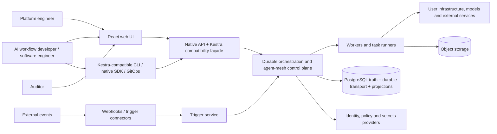
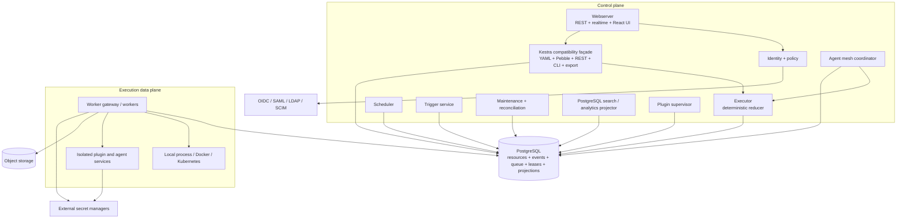

# AMESH target architecture

## Status

This architecture incorporates the product-owner decisions recorded through 2026-08-19. AMESH is a strict clean-room, AGPL-3.0-only orchestration platform targeting version-pinned Kestra compatibility plus agent-native capabilities.

The production durable control plane uses Python 3.12 asyncio ([ADR-016](../adr/016-python-production-core.md); the earlier [Java 25 evaluation](backend-language-evaluation.md) is retained as history). PostgreSQL, React/TypeScript, runner scope, compatibility scope, on-premises Kubernetes, profile M, minimal v1 recovery, full migration, compliance readiness, AI merge authority and the isolated plugin model are also accepted decisions. No foundational product decision blocks implementation.

## Context

## Container view

## Logical services

| Service | Responsibility | Must not do |
|---|---|---|
| Webserver | Native and compatible REST APIs, realtime streams, UI assets and authentication entry points | Run user task code or own scheduling state |
| Compatibility façade | Preserve pinned Kestra YAML, Pebble, REST, CLI, execution and import/export behavior | Mutate core state outside commands or silently approximate unsupported behavior |
| Executor | Apply commands/events through a deterministic reducer and emit next actions | Call arbitrary external services |
| Scheduler | Calculate temporal occurrences and acquire fenced schedule ownership | Execute tasks |
| Trigger service | Operate polling/realtime trigger instances and durable checkpoints | Mutate execution state outside commands |
| Worker | Claim task runs, materialize files, call a runner/plugin and report fenced results | Make workflow-graph decisions |
| Agent mesh coordinator | Manage durable agent sessions, typed hand-offs, budgets, tool policy and checkpoints | Bypass workflow state, tenant policy or runner isolation |
| Plugin supervisor | Discover, resolve and supervise plugin versions | Make plugin process state authoritative |
| Projector | Build PostgreSQL search, log and analytics projections | Become orchestration truth |
| Maintenance | Reconciliation, purge, retention, migration and operational jobs | Guess ambiguous repairs |
| Identity/policy | Authenticate, authorize and evaluate admission policy | Trust UI-side decisions |
| Object storage | Hold namespace files, large inputs/outputs and artifacts | Hold orchestration transitions |
| PostgreSQL | Hold resources, current state, immutable events, inbox/outbox, durable queues, leases and projections | Hold unbounded artifact blobs or execute arbitrary user code |

## Core invariants

1. An execution is pinned to one flow revision, one compatibility target and one resolved plugin/agent set.
2. State changes are accepted only through version-checked commands and a deterministic reducer.
3. Every committed state change and its outbound work records share a PostgreSQL transaction.
4. A notification is never proof of delivery; durable rows are proof.
5. Duplicate delivery produces no duplicate logical transition.
6. A task attempt has at most one current fenced owner.
7. A stale owner cannot commit after lease transfer, cancellation, retry or restart.
8. Search and dashboards may lag; orchestration cannot depend on them.
9. Worker, agent and plugin credentials are scoped to one tenant, attempt and capability.
10. Large files move through object storage using opaque URIs and checksums.
11. Cross-tenant access is denied before resource existence or protected data is disclosed.
12. A full compatibility claim requires green differential evidence for every declared surface.
13. Agent loops, model use, tool calls and hand-offs are bounded by policy and budget.

## Deployment profiles

### Developer

- API, executor, scheduler, trigger, worker and maintenance roles may run in one process.
- PostgreSQL stores state, queues and projections.
- MinIO or local object storage holds artifacts.
- Development authentication is allowed only in non-production mode.

### Single-host production

- Roles may share one deployable but use independent internal executors and health checks.
- PostgreSQL is operated with tested backups and point-in-time recovery.
- S3-compatible object storage is strongly recommended.
- Process and Docker runners are available; Kubernetes runner is optional.

### On-premises Kubernetes production — reference profile

- Webserver, executor, scheduler, triggers, projectors, maintenance and workers scale independently.
- All coordination still uses PostgreSQL queues, leases and fencing.
- On-premises Kubernetes/Helm is the first real production and release-qualification target.
- External PostgreSQL and S3-compatible object storage are required; no public-cloud control plane or licence server is mandatory.
- Workers may run in private networks and communicate through authenticated API/queue claims and object storage.
- Stable releases include an offline installation bundle for disconnected environments.
- Qualification uses profile M: 100,000 executions/day, 1,000 active task runs, 50 starts/second and 10 million retained execution records.
- The v1 recovery gate is RPO <= 48 hours and RTO <= 8 hours.

## Execution path

1. API or trigger submits `CreateExecution` with an idempotency key and compatibility revision.
2. One transaction stores execution state, immutable event and durable queue/outbox rows.
3. PostgreSQL notification may wake consumers; polling guarantees recovery.
4. Executor claims committed work and determines runnable tasks.
5. Dispatch records exist durably before workers can claim them.
6. A worker obtains an expiring lease and monotonically increasing fencing token.
7. The worker executes through a local, Docker or Kubernetes runner, or an isolated plugin/agent service.
8. Completion is accepted only if attempt, owner, lease and fencing token still match.
9. The executor reduces the result, creates downstream work or finalizes the execution.
10. Projectors and realtime consumers update disposable views after authoritative commit.

## Accepted technology choices

| Area | Choice | Status |
|---|---|---|
| Production core | Python 3.12 asyncio (ADR-016); the checked-in foundation is the production engine seed | Accepted |
| Metadata and execution state | PostgreSQL only | Accepted |
| Internal durable transport | PostgreSQL queue/outbox/inbox/leases; `LISTEN/NOTIFY` wake-up only | Accepted |
| Search and analytics | PostgreSQL FTS, partitioned projections, materialized views and rollups | Accepted |
| Object storage | Local for development; S3-compatible for production, MinIO reference | Accepted |
| Frontend | React/TypeScript | Accepted |
| Plugins | Isolated RPC/OCI by default; Java/Python/TypeScript SDKs first | Accepted |
| Runners | Local process, Docker/OCI, Kubernetes | Accepted |
| Production topology | On-premises Kubernetes/Helm; Docker Compose development; single-host secondary | Accepted |
| Scale | Profile M: 100k executions/day, 1k active tasks, 50 starts/s, 10m retained | Accepted |
| Recovery | v1 RPO <= 48h and RTO <= 8h; tighter 4h/4h post-GA target | Accepted |
| Migration | Full side-by-side resources, governance, history, logs, artifacts and audit evidence | Accepted |
| Compliance | SOC 2 and ISO/IEC 27001 readiness; no certification claim | Accepted |
| Licence | AGPL-3.0-only, one fully open distribution | Accepted and confirmed |

## Detailed documents

- [Backend language evaluation](backend-language-evaluation.md)
- [Flow DSL and validation](flow-dsl.md)
- [PostgreSQL durable transport](postgresql-transport.md)
- [Execution semantics](execution-semantics.md)
- [State machine](state-machine.md)
- [Data model](data-model.md)
- [Messaging and delivery](messaging.md)
- [Scheduler and triggers](scheduler-and-triggers.md)
- [Workers and runners](workers-and-runners.md)
- [Plugin architecture](plugins.md)
- [Security and tenancy](security-and-tenancy.md)
- [API and UI](api-and-ui.md)
- [Deployment](deployment.md)
- [On-premises Kubernetes reference](on-premises-kubernetes.md)
- [Full migration architecture](migration.md)
- [Observability](observability.md)
- [Failure model](failure-model.md)
- [HA and disaster recovery](ha-and-dr.md)
- [Compatibility architecture](compatibility.md)
