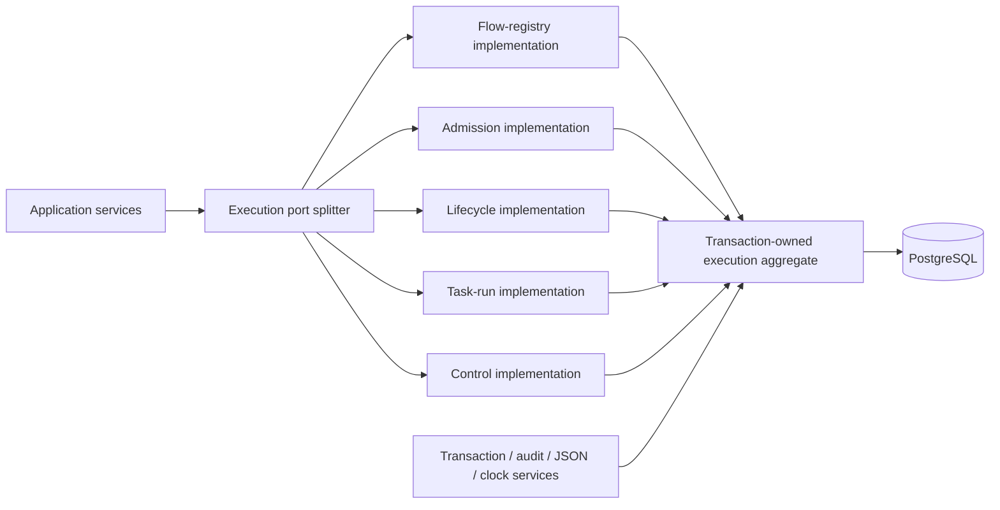

# Data model

The schema is normalized for authoritative state and append-only evidence. Large payloads are referenced
by object-storage URI.

## Principal aggregates

| Aggregate | Natural key | Runtime key | Notes |
|---|---|---|---|
| Tenant | tenant slug | tenant UUID | Mandatory outside explicit single-tenant mode |
| Namespace | tenant + dotted namespace | namespace UUID | Hierarchical permissions and inheritance |
| Flow | tenant + namespace + flow ID | flow UUID | Stable identity |
| Flow revision | flow + revision number/hash | revision UUID | Immutable canonical definition |
| Execution | execution ID | sortable UUID | Pinned revision and plugin resolution |
| Task run | execution + task path + iteration | task-run UUID | Logical task across attempts |
| Task attempt | task run + attempt number | attempt UUID | Fenced worker ownership |
| Trigger | flow revision + trigger ID | trigger UUID | Definition |
| Trigger instance | trigger + service shard | instance UUID | Checkpoint and operational state |
| Worker | worker identity | worker UUID | Capabilities, labels and heartbeat |
| Backfill | backfill ID | UUID | Generates occurrence set |
| Plugin package | name + version + digest | package UUID | Immutable artifact |
| Asset | provider + external key | asset UUID | Catalog and lineage |
| App/approval | tenant-scoped key | UUID | Human interaction resources |

## Canonical resource contract

User-facing natural keys preserve spelling and compare case-sensitively. Flow, task, input and trigger IDs match `^[a-zA-Z0-9][a-zA-Z0-9_-]*$`; dotted namespaces validate each segment by the same rule. Tenant slugs are lowercase. Length limits and the internal reserved prefix are enforced by the domain identity module and reused by DSL, API and persistence adapters.

Mutable runtime records use RFC 9562 UUIDv7 values generated in the application. Existing persisted UUID values remain readable during migration. A managed resource carries labels, annotations, creation/update timestamps, creating/updating actor, a monotonically increasing resource version and an ETag derived from its canonical representation.

Lifecycle is explicit: `ACTIVE` resources may be archived or tombstoned, archived resources may be restored or tombstoned, and tombstones may be restored only while their retained metadata exists. Hard deletion is a retention operation outside ordinary resource CRUD. Lifecycle transitions return a new versioned value and reject stale expected versions.

Canonical hashing uses compact UTF-8 JSON with recursively sorted object keys over the current I-JSON-compatible resource value domain. Arrays retain order. Hash and ETag inputs exclude their own derived digest fields.

## Core tables

```text
tenants, namespaces
flows, flow_revisions, flow_revision_plugins
executions, execution_events
task_runs, task_attempts, task_run_events
commands_inbox, messages_outbox, consumed_messages
dispatches, leases, resource_reservations
trigger_definitions, trigger_instances, trigger_occurrences
workers, service_instances
backfills, backfill_items, backfill_events
namespace_files, kv_entries, secret_metadata
artifacts, artifact_references, cache_entries
logs, metrics, execution_outputs
plugin_packages, plugin_types, plugin_policies
users, groups, roles, bindings, service_accounts, api_tokens
audit_events, policy_decisions
assets, lineage_edges
retention_jobs, reconciliation_jobs
```

`lifecycle_policies`, `lifecycle_legal_holds`, `lifecycle_jobs`, `lifecycle_job_items` and
`lifecycle_events` implement `retention_jobs`: previews snapshot the policy and impact, execution
purge retains compact tombstones, external object decisions remain retryable, and lifecycle events
publish through the transactional outbox. See [ADR-039](../adr/039-authoritative-resumable-retention-lifecycle.md).

## Event storage

Events are append-only and include aggregate ID, aggregate version, event type, schema version, tenant,
correlation, causation, actor, event time and payload. The current snapshot is optimized state, not a
replacement for transition evidence.

The first implementation is not a universal event-sourcing framework: resource CRUD that does not need
replay may use ordinary revision history plus audit events. Execution and task state must be replayable.

## Tenant isolation

Every tenant-owned row contains `tenant_id`; every unique constraint and index includes it where
appropriate. Repositories require tenant context. PostgreSQL row-level security is evaluated as defense
in depth, not the sole authorization layer.

## Repository boundaries

Application and domain modules depend on Protocols from `amesh.ports`; the PostgreSQL classes are
selected only by entry-point composition. Every production PostgreSQL repository explicitly implements
its checked port. Common `NotFoundError`, `VersionConflict` and `ProviderError` families let callers
handle boundary failures without importing an adapter-specific exception.



The splitter returns five pairwise-distinct, cached PostgreSQL responsibility objects with only their
declared port surface. They delegate to one transaction-owning aggregate so multi-row creation,
admission, lifecycle, task-run and intervention operations retain one commit and idempotency boundary.
`PostgresExecutionRepository` remains the compatibility facade for existing callers.

`PostgresRepositoryServices` is the shared composition boundary for tenant/admin transactions, atomic
audit writes, persistence JSON and application time. All engine-owning PostgreSQL repository sources use
the common base; database-authoritative lease, fencing and ordering clocks remain SQL operations. Tenant
resolution lives in `tenant_context.py`, and execution rows shared by execution control and transfer are
mapped once in `execution_rows.py`.

### EPIC-838 M7 repository measurements

The M7 baseline is `main` after M6. Counts cover `adapters/postgres` plus the PostgreSQL differential
repository in `quality/repository.py`.

| Measurement | Before | After |
| --- | ---: | ---: |
| Repository source files adopting `PostgresRepositoryBase` | 1 | 41 |
| Distinct objects returned for the five execution ports | 1 | 5 |
| Direct tenant/admin helper calls outside shared support | 360 | 0 |
| Embedded `audit_events` insert implementations | 23 | 0 |
| Raw raised `LookupError` sites | 117 | 0 |
| `execution_repository.py` physical lines | 4,861 | 4,783 |
| `execution_control_repository.py` physical lines | 1,030 | 1,023 |

The responsibility split adds a 757-line protocol-exact delegation module and a 188-line shared row
mapper module. These additions make ownership and adoption mechanically testable without moving SQL out
of its existing atomic transaction boundary.

## Storage boundaries

- Metadata database: identifiers, state, structured small outputs and object references.
- Object storage: files, artifacts, large outputs, import/export bundles and plugin packages.
- Event bus: bounded messages and references, never large files.
- Search: tenant-hash-partitioned `search_documents_v2` stores multiple projection generations with
  denormalized metadata, weighted full-text vectors and structured JSON fields. Indexer-owned state,
  per-type position/checksum checkpoints, protected retention archives and daily rollups are all
  tenant-scoped. A scoped generation builds beside the active one and switches only after verification;
  rebuild, failure and control evidence remains in the immutable event stream and transactional outbox.
