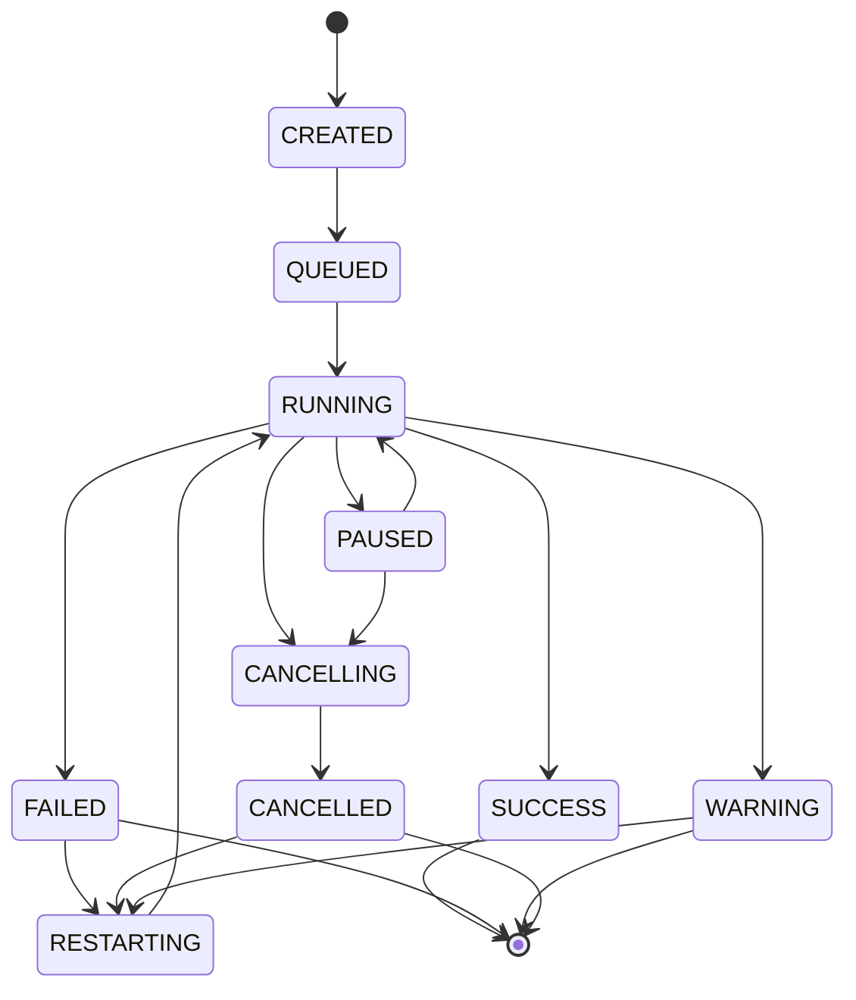
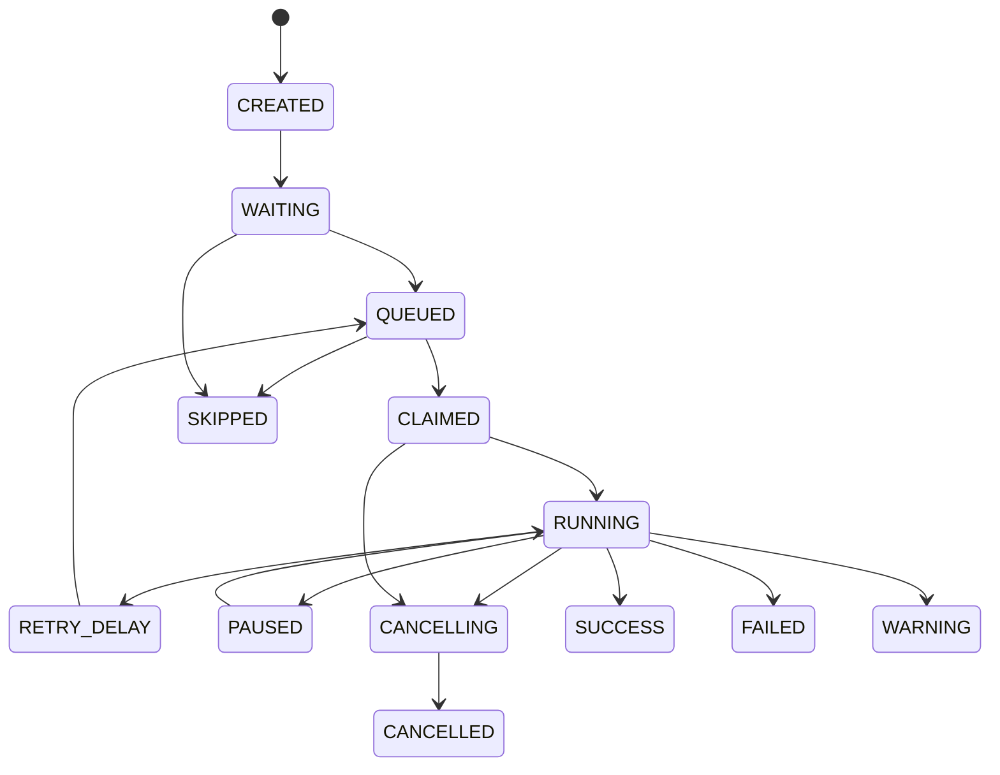

# State machines

## Execution states

Terminal states are `SUCCESS`, `FAILED`, `WARNING` and `CANCELLED`. A restart creates a new execution
epoch and explicit reset events; it does not rewrite historical events.

## Task-run states

`CLAIMED` means a worker lease exists; `RUNNING` means the runner or plugin acknowledged start.
Lease expiry never directly creates success or failure. It creates a recovery decision that either
requeues, retries, marks infrastructure failure or quarantines ambiguous work according to policy.

## Trigger states

`CREATED → ACTIVE ↔ PAUSED → DISABLED → DELETED`

Each trigger revision also has an operational condition: healthy, degraded, failed or checkpoint-blocked.
Operational health does not silently change authoring lifecycle state.

## Service and worker lifecycle

`STARTING → READY → DRAINING → STOPPED`, with `DEGRADED` as a health condition. A service must publish
its version and supported contract ranges before becoming ready.

## Reducer rules

- Transitions are enumerated; no free-form state assignment exists.
- The reducer is pure and receives explicit time and generated IDs as input.
- Invariants are checked before events are persisted.
- Rejected commands never partially mutate the aggregate.
- Event upcasting occurs before reduction and is tested against golden streams.
